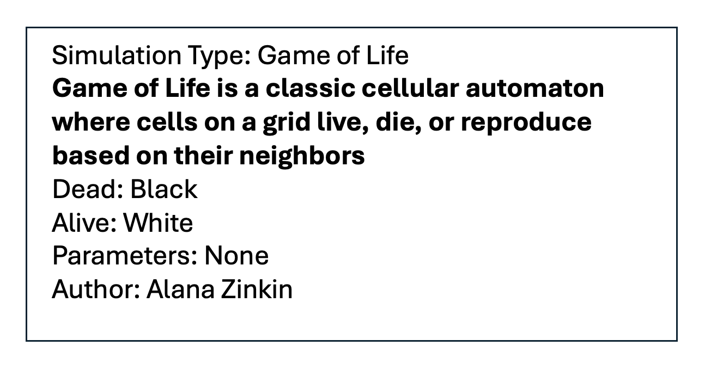

# Cell Society Design Plan

### Team Number: 05

### Names: Tatum McKinnis, Angela Predolac, Alana Zinkin

## Overview

The primary problem this program aims to solve is the lack of intuitive, flexible, and extensible tools for simulating and visualizing Cellular Automata (CA) models. Cellular Automata are powerful for studying complex systems, modeling natural phenomena, and exploring mathematical concepts. However, existing tools often fall short in modularity, customization, and user-friendliness, making it difficult for users to experiment with different CA models or extend the platform for new use cases. This program addresses these challenges by focusing on three key design goals: flexibility, user-friendliness, and modularity.

Flexibility is achieved by allowing users to define rules, parameters, and grid structures for new CA models through external configuration files, eliminating the need to modify the program's core logic. The user interface is designed to be clean and simple, enabling users to load simulations, adjust parameters like speed, and observe grid evolution in real time. Additionally, the program provides clear feedback for errors, such as invalid input files or unsupported grid formats, ensuring a seamless user experience.

The architecture of the program emphasizes modularity and extensibility by adhering to the principle of being "closed for modification, open for extension." Core components such as grid manipulation, simulation rules, and rendering are designed to be stable and unchanging, while extension points are provided through well-defined abstractions and interfaces. This allows developers to add new CA models, file configurations, or display formats without altering existing code.

At a high level, the program creates a robust and adaptable framework for simulating a variety of CA models, including Conway's Game of Life, Spreading of Fire, Schelling's Model of Segregation, and Wa-Tor World. The design separates concerns into modular components—such as grid management, rule execution, and user interaction—ensuring that each part of the program can be developed, tested, and extended independently while maintaining seamless integration and scalability.By focusing on high-level abstractions, this program is designed to be both versatile and user-friendly, catering to a wide range of users.

## User Interface

Example UI displaying simulation and relevant buttons:
* Our UI will display the simulation itself according to the particular ruleset and will have both "start" and "pause" buttons to start and stop the simulation, respectively. It will also contain a "save" button, which will save the state of the simulation in an XML file. It will also contain a "reset" button to revert the simulation to its original state and a "Select Simulation" button to chose which type of simulation to load.


Example descriptive information dialog box:
* The dialog box will be used to display relevant simulation information, such as the simulation type, a description of the simulation, authors, color mappings for cells, and parameters (if they exist).




## Configuration File Format

* [Example 1](../data/ExampleSimulation1.xml)
* [Example 2](../data/ExampleSimulation2.xml)

## Design Overview and Details

#### Design Overview:

This design follows the Model-View-Controller (MVC) Pattern to separate the logic of the simulation, its visual representation, and user interactions. The abstractions created in the design are grouped into the Model, View, and Controller layers, each serving a specific function.

Model Layer:

- Simulation: An abstract class that handles the simulation's core logic, including rules and state transitions. Different simulations will inherit from this class and implement their specific behavior.
- Cell: Represents each cell in the grid, stores and manages the state of each cell, and computes the next state based on simulation rules.
- Grid: Manages a 2D array or list of Cell objects, tracks the grid's dimensions and coordinates, updates cell states, and computes interactions between neighboring cells.
- State: A class that holds all the possible states of the states. This can be implemented as an enum or constants class.
- XML Parser: Reads and parses configuration XML files, extracting simulation parameters, grid sizes, and intial states.

View Layer:

- SimulationView: Responsible for rendering the simulation. Listens for state changes in the model adn updates the grid display accordingly.
- GridView: Specifically handles the rendering of the grid of cells. When the state of the cells changes, this view ensures the grid is updated visually.
- SimulationInfoPanel: Displays data such as the simulation's title, description, and parameters
- ControlPanel: Provides buttons for controlling the simulation (start, pause, stop) and sliders to adjust simulation speed. Can also include an option to load new simulation configurations.

Controller Layer:

- SimulationController: Manages the user's interactions with the simulation, invoking methods on the Simulation to update the state, and passes information to the view to render.

Helper Classes:

- SimulationParameter: Holds simulation-specific parameters (e.g., rate of fire spread). These parameters control the behavior of the simulation and are passed into the respective simulation class for execution.

Collaboration between Modules:

- User input: The SimulationView captures user input, passing it to the SimulationController. Additionally, configuration files are read to initialize the simulation.
- Model Update: The SimulationController communicates with the Simulation class to update the grid and cell states based on either user actions or the configuration file input.
- View Update: After the model updates, the SimulationView re-renders the grid based on the new cell states, reflecting any changes due to user input or file-based initialization.

#### Design Details

Model Classes:

- Simulation:
  - Functionality: Abstract base class for all simulation types. Defines essential methods like step() (updates simulation state) and intialize (sets up the initial state). Subclasses, such as GameOfLifeSimulation, implement their specific simulation rules
  - Collaboration: Works with Grid and Cell classes to update the simulation state at each step. Does not expose the grid's internal data structure, instead Simulation interacts with Grid through methods that allow updates or queries on cell states (e.g., getCellState, setCellState, or getNeighbors()).
  - Resources Needed: Needs access to Grid and the Cell objects for updating their states. Also needs to interact with Cell methods to compute the next state of each cell based on the simulation rules.
- Cell:
  - Functionality: Each cell in the grid has a state and can compute its next state based on the simulation rules. The cell transitions between states according to the simulation subclass logic.
  - Collaboration: Interacts with Grid primarily by holding a reference to its position (row and column), whcih allows it to be identified within the grid. The Simulation class determines how the cell's state transitions, and the cell provides its current state to the Simulation for those calculations.
  - Resources Needed: Each cell needs a reference to its position in the grid and it also requires a state to track its current status and compute the next state during each simulation step.
- Grid:
  - Functionality: Manages a collection of cell objects in a 2D array or list of lists. Maintains the grid's size and manages interactions between neighboring cells, like determining which cells need to be updated based on the simulation's rules. Triggers updates for individual cells' states by delegating that responsibility to the Simulation class.
  - Collaboration: Interacts with Cell class to get or set the state of individual cells. Works closely with Simulation class, which updates the states of cells based on rules. Provides access to Cell objects in a way that abstracts away its internal structure and allows the Simulation to interact with them directly.
  - Resources Needed: A data structure to store Cell objects.
- State:
  - Functionality: Implemented as an enum or constants class. Defines the possibile states of cells and ensures that the simulation uses consistent state values across different cells.
  - Collaboration: Used by Cell to define the state of each cell.
  - Resources Needed: No external resources are needed except for constants or enum values.
- XML Parser:
  - Functionality: Responsible for parsing XML files that define simulation configurations, including grid size, intial states of cells, adn any other parameters. Extracts these values and makes them available for the Simulation class to use.
  - Collaboration: Works with the Simulation class to load configuration data and initialize the simulation.
  - Resources Needed: Access to XML configuration files and possibly a reference to the SimulationParameter class

View Classes

- SimulationView:
  - Functionality: Renders the simulation state by listening for changes in the simulation and updating the grid display accordingly
  - Collaboration: Interacts with SimulatioController to start, pause, or stop the simulation and with the Simulation class to update the display when the isulation state changes.
  - Resources Needed: JavaFX components to render the grid and handle user input events
- GridView
  - Functionality: Specialized view for rendering the grid of cells. Ensures that when a cell's state changes, the corresponding part of the grid is visually updated.
  - Collaboration: Works with SimulationView to update the grid and updates as the Simulation progresses
  - Resources Needed: JavaFX UI components to visualize the grid cells.
- SimulationInfoPanel:
  - Functionality: Displays data like title, author, description, and parameters of the simulation
  - Collaboration: Works with SimulationController to fetch and display relevant information about the simulation.
  - Resources Needed: JavaFX components to display labels and text.
- ControlPanel:
  - Functionality: Provides user interface elements such as buttons for controlling the speed and sliders for adjusting the speed
  - Collaboration: Works with SimulationController to pass user commands for simulation control
  - Resources Needed: JavaFX UI components for buttons and sliders

Controller Classes:

- SimulationController:
  - Functionality: Listens for user interactions (e.g., button presses to start, pause, or reset the simulation). Interacts with Simulation class to update the state based on these actions and communicates with the view to update the display.
  - Collaboration: Coordinates the interaction between the Simulation, View, and user input
  - Resources Needed: Access to Simulation model and SimulationView for updates

Helper Classes

- SimulationParameter:
  - Functionality: Centralizes the parameters needed by the Simulation. Makes the configuration data easily accessible and can be passed to the appropriate simulation class.
  - Collaboration: Works with Simulation class to pass the necessary parameters for simulation behavior.
  - Resources Needed: None

#### Abstracting Implementation Details

In the design, method signatures are carefully crafted to abstract away the differences between various implementations of the data structure, file format, and OpenJFX "grid" component. For example, the Simulation class defines general methods like step() and initialize() that perform simulation-related actions without specifying how they interact with the underlying grid structure. The grid's internal representation—whether it's a 2D array, list of lists, or another structure—is hidden from the rest of the system. Methods like getCellState(), setCellState(), and getNeighbors() allow interaction with the grid's cells without exposing the implementation details of how cells are stored or organized. Similarly, the XML Parser class defines generic methods for parsing simulation configuration files (e.g., parseConfig()) without making assumptions about the specific format or structure of the XML files. This approach ensures that the system can handle different file formats or data structures as long as they adhere to a common interface. For the OpenJFX grid component, the method signatures in the view (like updateGrid() or renderCell()) focus on high-level actions such as updating the display, without being tied to a particular implementation of the grid's visual representation in JavaFX. This abstraction ensures flexibility in the implementation while maintaining clear, reusable interfaces across different components of the simulation.

#### Picture of Relations Between Modules

```plaintext
                           +---------------------+
                           |  Simulation (Model)  |
                           +---------------------+
                           | - step()             |
                           | - initialize()       |
                           +-----------+---------+
                                       |
        +------------------------------+-------------------------+
        |                                                     |
        | communicates with                                      |
        |                                                     |
+-------v---------+                                    +--------v-----------+
|     Grid        |                                    |     XML Parser     |
|   (Model)       |                                    |    (Model)         |
+-----------------+                                    +-------------------+
| - getCellState()|                                    | - parseConfig()    |
| - setCellState()|                                    +-------------------+
| - getNeighbors()|
+-----------------+                          
        |                                      
        | interacts with                            
        |                                        
+-------v--------+             +---------------------+         +--------------------+
|     Cell       |<----------->| SimulationController|<------->| SimulationView     |
|    (Model)     |             |      (Controller)    |         |      (View)        |
+----------------+             +---------------------+         +--------------------+
| - state        |             | - startSimulation()  |         | - updateGrid()      |
| - nextState()  |             | - pauseSimulation()  |         +--------------------+
+----------------+             | - resetSimulation()  |                |
        |                      +----------+----------+                |
        |                                 |                          | interacts with
        | interacts with                  |                          |
        |                                 |                          |
+-------v--------+                      |                          |
|     State      |<---------------------+                          |
|    (Model)     |                      |                          |
+----------------+                      |                          |
| - Enum/Consts  |                      |                          |
+----------------+                      |                          |
        |                               |                          |
        | interacts with                |                          |
        |                               |                          |
+-------v--------+             +--------------------+             +---------------------+
|  ControlPanel  |<----------->|  GridView (View)   |<----------->| SimulationInfoPanel |
|     (View)     |             |       (View)       |             |      (View)          |
+----------------+             +--------------------+             +---------------------+
| - userControl()|             | - renderGrid()      |             | - displayInfo()      |
| - adjustSpeed()|             +--------------------+             +---------------------+
+----------------+
```

## Use Cases

Use Case 1: Apply the rules to a middle cell: set the next state of a cell to dead by counting its number of neighbors using the Game of Life rules for a cell in the middle (i.e., with all its neighbors)

- Within step() of the Simulation class, call updateState(cell) of the Grid class, which calls the countAliveNeighbors() method of Grid class, the getState(cell) method of the Cell class to check if it's alive or dead. In our use case, the cell would be dead. Then we call setNextState(cell) of the Cell class according to the game rules in the Simulation class which uses the return value of the countAliveNeighbors() method

Use Case 2: Apply the rules to an edge cell: set the next state of a cell to live by counting its number of neighbors using the Game of Life rules for a cell on the edge (i.e., with some of its neighbors missing)

- The Simulation class calls the step() method. The step() method calls getNeighbors() on the Gird class to retrieve the neighboring cells of an edge Cell. The getNeighbors() method in the Grid class checks the edge conditions and calculates the neighbors the edge cell. Since it's an edge cell, getNeighbors() needs to account for the fact that some neighbors might be missing (e.g., no neighbors on the "out of bounds" side of the grid).The Simulation class computes the new state for the Cell (setting it to "live" based on its neighbors' states). In this case, if the edge cell has the right number of live neighbors, it may be set to "live" according to the Game of Life rules. The Simulation class uses setCellState() to update the cell state. SimulationView refreshes the visual grid to reflect the updated state.

Use Case 3: Move to the next generation: update all cells in a simulation from their current state to their next state and display the result graphically.

- For each individual Cell object, we store the current state as well as the next state. When we call the updateState() method for each Cell, we accurately calculate the next state based on the current state and the current states of neighboring cells. This ensures that the next state of a cell does not impact neighboring cells until after all cells have been updated within the same round or generation of the simulation. When we call the step() method in the Simulation class, we iterate over each cell and call updateState() to calculate the next step. Then, at the very end we update the current state for each cell to be equal to the next state. This way, all cells will be updated at the same time. We then display this graphically by changing the cell's depiction based on whether they are alive or dead.

Use Case 4: Switch simulations: load a new simulation from a data file, replacing the current running simulation with the newly loaded one

- To switch simulations, the user would press a "Switch Simulation" button in the ControlPanel of the View layer. Next, the SimulatioController class would parse the XML file provided by the user or already in the data bank and notify View to change the display. The Simulation class will clear the current simulation and replace it with a new grid based on the provided XML file using the initialize() method. A new Grid will be created from the file and new Cells will be initialized. In SimulationView, the current grid will be cleared and replaced with a visualization of the new one. The visual representation of each cell will also be updated in GridView. The new simulation details will also be shown in SimulationInfoPanel.

Use Case 5: Set a simulation parameter: set the value of a parameter, probCatch, for a simulation, Fire, based on the value given in a data file

- The user will use the ControlPanel to select an input file to load the data from. The XML Parser will read the file and extract the value of probCatch, then pass it to SimulatioController. SimulatioController then calls the setParameter() method to update the value of probCatch. This is then updated in the SimulationParameter object of the active Fire Simulation class. Finally, SimulationView updates to display any visual changes as a result of setting this parameter.

Tatum's Use Case 1: Pause and Resume Simulation Execution

- Scenario: This use case shows how the simulation can be paused (freezing the current state) and later resumed (continuing from the last frozen state).
- Pausing the Simulation: The user presses the "Pause" button, and the simulation haults, preserving the current grid state.
  - The SimulationController calls Simulation.pauseExecution(), which stops the smulation (using a timer or loop). The UI is then updated to show that the simulation is paused.
- Resuming the Simulation: The user presses the "Resume" button, and the simulation continues from the paused state.
  - The SimulationController calls Simulation.resumeExecution(), which restarts the simulation, and the UI is updated to show the resumed state.

Pseudocode for Tatum's Use Case 1:

// SimulationController manages user input and controls simulation flow
SimulationController:
Method: pauseSimulation()
// Inform the simulation to pause
Simulation.pauseExecution()

// Update the view to reflect the paused state
SimulationView.displayPaused()

Method: resumeSimulation()
// Inform the simulation to resume execution
Simulation.resumeExecution()

// Update the view to reflect the resumed state
SimulationView.displayResumed()


// Simulation manages the execution and state transitions
Simulation:
Method: pauseExecution()
// Stop the simulation timer or game loop
Timer.stop()

// Set a flag indicating that the simulation is paused
Simulation.setPaused(true)

Method: resumeExecution()
// Resume the simulation timer or game loop
Timer.start()

// Set the flag to indicate the simulation is no longer paused
Simulation.setPaused(false)

Method: setPaused(pausedStatus)
// Store the paused state
this.paused = pausedStatus


SimulationView:
Method: displayPaused()
// Change the UI to show the simulation is paused
GridView.updateDisplayToPaused()
ControlPanel.updateButtonState("Resume")

Method: displayResumed()
// Change the UI to show the simulation is running
GridView.updateDisplayToRunning()
ControlPanel.updateButtonState("Pause")


Alana's Use Case 1:
Scenario: This use case demonstrates how the user can speed up or slow down the simulation.
- When the user slides the button to a higher number than it's current position, the simulation should speed up and display more frames per second
- When the user slides the button to a lower number than it's current position, the simulation should slow down and display fewer frames per second

Pseudocode:

// SimulationController manages user input and controls simulation flow
SimulationController:
Method: setSpeed(int speed)
// receive user input from the slider display to increase the simulation speed

ControlPanel:
Method: adjustSpeed(int speed)
// update the slider to reflect the change
// this can be done using a listener
Method: slider.setSpeed(int speed)

Simulation:
// update the timer speed to reflect the new user input
Timer.setDelay(int speed)

Alana's Use Case 2: Provide a mechanism to save the current state of the simulation. 
- When the user invokes this save mechanism (i.e., clicks the button), the current state of the simulation should be saved as an XML configuration file matching the XML configuration specification
- When the user loads this XML file, the simulation should return to the exact state it was in when the file was saved.

Pseudocode:
Generating the File Upon Clicking "Save":
SimulationController
// press the save button
Method: saveSimulation()

Grid
Method: makeGridCopy()
Integer[][] gridCopy = grid.clone()

XMLParser
 generateFile(copyGrid)
  * Initialize new DOM
  * parseConfig(originalFile)
  * convert 2D gridCopy to String
  * set <initial_states> = String of gridCopy
  * name file as savedState_TIMESTAMP
  * save file as new file in current simulation data folder

Loading the File:

Simulation
Method: initialize()
//Call initialize method to start a new simulation

XML Parser
Method: parseConfig(String xmlFilePath) where xmlFilePath = data/FOLDER/savedState_TIMESTAMP
// Parse the newly generated XML file

## Design Considerations

1. Grid or no grid?
* Possible ideas:
  * Representing a grid with a 2D-array but as a private instance variable in a GameState class is one idea; we wouldn't include a getGrid() method to keep this grid private.
  * Another option is to have an implicit grid represented with an adjacency list of neighboring cells as an instance variable of each Cell object. This would avoid needing to even create a grid, but it may make it more difficult for visualization purposes.
2. How do we ensure that when we update the state of the cells, it is based on the previous generation and not the current generation of cells?
* Possible ideas: 
  * Cell-based updates (cell manages its own state update, checking its neighbors and updating accordingly without explicitly maintaining two grids; each cell amkes its decision about its next state based on the previous state and triggers an update after all cells have been evaluated)
  * Use two grids (current and previous; current holds the state of the cells that has just been updated or is being processed, previous hods that state of the cells from the previous iteration or generation; when you update the cells, you reference the previous grid to compute the new state of the cells, but the updates themselves happen on the current grid)

#### Class and Method Design Choices

The team chose to follow the Model-View-Controller (MVC) pattern to ensure separation of concerns and modularity in the design. This structure allows for clearer management of simulation logic, visual rendering, and user input, which is crucial for maintainability and flexibility.

Model Layer: The core of the design revolves around the Simulation, Cell, Grid, State, and XML Parser classes. The Simulation class is abstract, allowing for different simulation types to be easily incorporated through subclassing. This approach avoids redundancy in the code and ensures that new simulations can be integrated smoothly. The Cell class represents each individual cell in the simulation, which keeps the simulation data encapsulated and manageable. The Grid class manages these cells in a 2D array, making it easier to perform operations like state updates or neighborhood checks.

View Layer: The SimulationView, GridView, SimulationInfoPanel, and ControlPanel handle all aspects of user interaction and display. This separation ensures that changes to the user interface or the underlying simulation logic can be made independently without affecting the other. The SimulationView ensures the user sees the latest state of the simulation, and the ControlPanel gives the user the ability to control simulation parameters in real time.

Controller Layer: The SimulationController is central to handling user interactions, acting as a mediator between the Model and View layers. It processes user inputs from the ControlPanel (e.g., start, pause, or reset simulation) and triggers corresponding actions in the Simulation class, which in turn updates the view.

## Team Responsibilities

* Team Member #1 (Alana Zinkin): Responsible for the View 
* Team Member #2 (Tatum Mckinnis): Responsible for the Model
* Team Member #3 (Angela Predolac): Responsible for the Controller 
