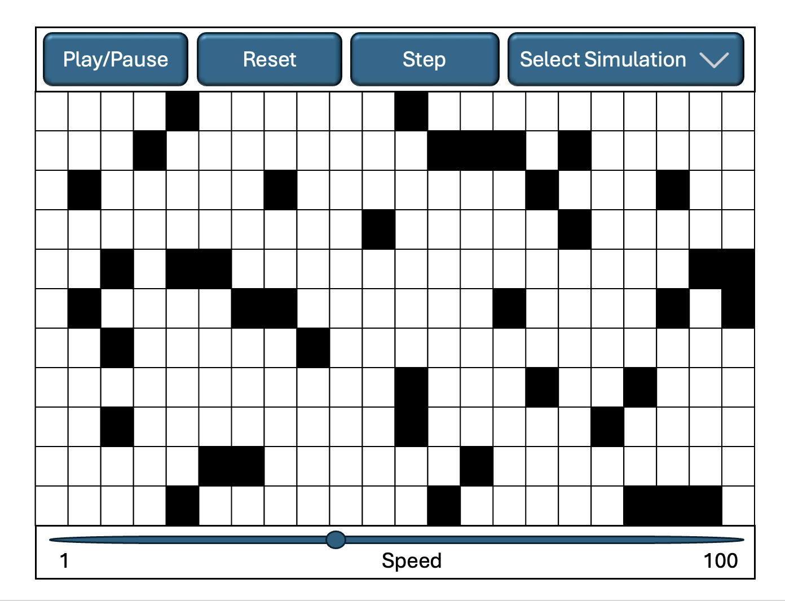

## CELL SOCIETY PRESENTATION

#### ALANA ZINKIN, TATUM MCKINNIS, ANGELA PREDOLAC

---

## DESIGN OVERVIEW

---

Our team's major design goals were to create flexible classes, methods, and easy to read code, such that future
development would be simple and straight-forward. Our main goal was to ensure that new simulations
could be easily added. We sought to adhere to SOLID design principles, include the Open-Closed principle,
Single-Responsibility principle, and reducing code redundancies. Our team wanted to make our code as clear and readable as possible
by using informative names and design patterns to ensure that future developers would be able to understand our classes and methods.
Finally, we sought to use common design patterns like Strategy and Factory to streamline development and allow for more flexibility.

---

## DESIGN 1 (CHANGED) : GridView creation

### Project Start

* Abstract GridView class with a grid for each type of simulation
* No class for each cell shape, assume cells can only be rectangles (BAD ASSUMPTION!)

### Mid-Project Change

* Keep abstract grid view class and create a concrete class for each tiling pattern
* Create factory class to initialize a GridView based on "tiling" configuration pattern
* Create CellShape interface and implement it for each type of cell shape
* Create a CellShape Factory for each shape to initialize them

---

---

## FEATURE HELPED

* Developers can easily add new GridViews for each shape
* Users can create a default grid view, which integrates various kinds of shapes
* Users can select different cell states to be represented by different shapes
* Users can override specific cell state setting by selecting a different tiling patter

---

## FEATURE CHALLENGED

* Four classes must be created for each type of tiling pattern because of the use of reflection
  to
  create a new GridView and CellShape (lots of overhead)
* Some classes, like hexagon and parallelogram had VERY similar structures and some duplicated
  code

---

## DESIGN 2 (Stable) : GridView creation

### Original Idea (From Our Design Plan):

"An abstract class that handles the simulation's core logic, including rules. Different simulations will inherit from this class and implement their specific behavior."

### Implementation:

A core abstraction that provided a shared structure for different types of simulations.

Implementing this from the beginning allowed us to:

* Prevent **code duplication** by sharing common functionality
* Ensure **scalability** for adding new simulation types easily
* Maintain **flexibility** in modifying and extending simulations
* **Encapsulate** specific simulation behavior within subclasses

## TESTING OVERVIEW

---

## TEST 1:

applyRules\_OpenCellWithPercolatedNeighbor\_BecomesPercolated() in PercolationTest

1. Verifies that when a percolation probability is set to 1 (100%), all OPEN cells adjacent to a PERCOLATED cell will become PERCOLATED after one simulation step.
2. Chose a percolation probability of 1 (100%) because this guarantees that percolation will occur, making it easier to verify the specific behavior where open cells next to percolated cells become percolated themselves

---

## TEST 2:

setCurrentState\_NullValue\_ThrowsIllegalArgumentException() in CellTest

1. Specifically checks that the setCurrentState() method properly validates its input by attempting to set the cell’s current state to null and verifies that this attempt throws an IllegalArgumentException
2. Chose to test with null because the class manages multiple states (current, next, previous) and these states must be maintained throughout state transitions to protect the cell’s transition logic. Null values would compromise this system, especially during operations like applyNextState() that rely on valid states.

---

## TEST 3:

applyRules\_LiveCellWithTwoLiveNeighbors\_Survives() in GameOfLifeTest

1. Verifies one of the core rules of Conway’s Game of Life: a live cell with exactly 2 live neighbors should survive to the next generation
2. Chose to test with exactly two neighbors because this is a key survival rule. It is one of the specific conditions where a live cell should continue living, making it a critical functionality to verify.

---

## TEST 4:

---

## TEST 5:

---

## TEST 6:

---

## TESTFX TEST 1:

makeGridLinesToggleButton\_clickButtonOnce\_GridLinesRemoved() in GridViewTest

1. Verifies that upon clicking the toggle grid lines button, the grid lines for all the cells are removed

---

## TESTFX TEST 2:

createGridView\_HexagonViewSelected\_GridNotNull() in GridViewTest

1. Uses percolation configuration
2. Verifies that the correct number of cells/shapes are displayed
3. Verifies that the shapes are the correct width and height
4. Verifies that the grid Pane contains all the shapes

---

## TESTFX TEST 3:

setupControlBar/_ControlBarExists/_ControlsAreShown() in ControlBarTest

1. Verifies all the elements of the control bar are non-null and added correctly
2. Verifies that they all have the correct value and are displayed within the bar itself

---

## API OVERVIEW

---

## API 1: MODEL

---

## KEY ABSTRACTIONS AND PUBLIC METHODS

1. Simulation: Abstract base class that manages cellular automata simulations
2. Grid: 2D container of cells that handles neighbor relationships, edge behaviors, and state updates
3. Cell: Fundamental unit that maintains its current, next, and previous states
4. StateInterface: An interface that defines the common behavior for all possible cell states
5. Edge Strategy: An interface that defines different ways to handle grid boundaries
6. Neighborhood Strategy: An interface that defines which cells are considered neighbors

---

## OPEN FOR EXTENSION

1. Template Method Pattern (Simulation)
2. Strategy Pattern (EdgeStrategy and NeighborhoodStrategy)
3. State Pattern (StateInterface)
4. Composition

---

## SUPPORT FOR READABLE, WELL-DESIGNED CODE FOR USERS AND TEAMMATES

1. Strong encapsulation
2. Error Prevention
3. Consistent naming conventions
4. Separation of concerns
5. Javadoc Documentation

---

## KEY IMPLEMENTATION DETAILS IT HIDES

---

## Cell State Transition Mechanism

1. Private State Variables
2. Hidden History Mechanism with Clean Public Interface

---

## Internal Grid Structure

1. Protected Cell Array
2. Hidden Cell Creation

---

## Validation Mechanics

1. Validation logic encapsulated in private methods
2. Error messages defined as private constants

---

## Simulation Iteration Management

1. Private iteration counter
2. Private reset functionality

---

## State Management 

1. Private State Maps
2. Private Color Maps

---

## USE CASE TO SHOW EFFECTIVENESS: PERCOLATION

---

## Single Focused Responsibility

1. Percolation Class: Simulation specific rules
2. PercolatonState Enum: Defines state values

---

## Extensibility Without Modification

1. Strategy Pattern Utilization
2. Template Method Pattern Utilization

---

## Well-Encapsulated Extension

1. Custom Percolation Probability Parameter

---

## Clear Simulation Rule Implementation

1. Clean implementation of rules via applyRules()

---

## Framework Integration

1. Seamless integration with framework's core features (Grid, Cell, Simulation)

---

## API 2: CONFIGURATION

---

## KEY ABSTRACTIONS AND PUBLIC METHODS

- SimulationController: Serves as the central controller for managing cellular automata simulations in the cell society application.
- SimulationController(), SimulationController(SimulationEngine, SimulationUI, SimulationFileManager, XMLStyleParser), selectSimulation(String, String, String, Stage, SimulationController), init(Stage, SimulationController), applyStyle(SimulationStyle), startSimulation(), pauseSimulation(), stepSimulation(), stepBackSimulation() , resetGrid(), setSimulationSpeed(double), loadStyle(String), chooseAndLoadStyle(), saveStyle(),
  saveSimulation(), setGridTiling(String, Map, Grid), setEdgeStrategy(String), setNeighborhoodStrategy(String), getSimulation(), getGrid(), getSimulationConfig(), getUI(), getIterationCount(), retrieveImmutableConfigResourceBundle()

---

## OPEN FOR EXTENSION

1. Simulation Types: The SimulationType enum in SimulationController allows for easily adding new simulation types. The fromString method provides a clean way to convert between display names and enum values.
2. Style Properties: The style system appears to be designed to support different visual aspects (cell appearances, grid properties, display options) that can be extended without modifying existing code.
3. Factory Pattern Usage: The code uses factory patterns to create various components, making it easy to add new edge handling or neighborhood strategies.
4. Reflection-Based Component Creation: The SimulationFactory uses reflection to dynamically create simulation instances, allowing new simulation types to be added without modifying the factory class itself.

---

## SUPPORT FOR READABLE, WELL-DESIGNED CODE FOR USERS AND TEAMMATES

1. Clear Separation of Concerns
2. Comprehensive Error Handling
3. Resource Bundling
4. Immutable Configuration Access
5. Encapsulation of Complex Operations

---

## KEY IMPLEMENTATION DETAILS IT HIDES

1. File Format and Parsing
2. Resource Management
3. Style Application Logic
4. Default Value Handling
5. Error Recovery

---

## USE CASE TO SHOW EFFECTIVENESS:

---

## TEAMWORK & COMMUNICATION OVERVIEW

---

## SIGNIFICANT POSITIVE EVENT

* Occasionally, a team member would be unable to contribute as much to the project, but each member of our team was able to pick up extra work to ensure that the project would be completed on time
* Our team never made other teammates feel bad when they couldn't contribute as much as normal, and we all supported one another.

---

## SIGNIFICANT PROBLEM

* A significant problem our team experienced was surrounding git and merge conflicts
* Merge conflicts were common - we often struggled to resolve them, which would break our main
  branch
* Our team learned that when you experience a merge conflict, you should either text or meet-up with your teammates to resolve it together
* We also learned the importance of testing within our own branches before pushing to main
* Everything should be fully functional and all tests should pass before merging to main

---

## STRONG TEAMWORK/COMMUNICATION

* Our team worked really well together because we constantly checked in with one another and were willing to solve problems for our other teammates rather than focus on our own features.
* This willingness to help one another and selflessness was what made working together so enjoyable

---

## TEAMWORK/COMMUNICATION AREA FOR IMPROVEMENT

* One area for improvement would be meeting in-person with our team more frequently
* Our team only met in person approximately once a week or less, but when we did meet in person, we found that it was significantly easier to complete the project
* This form of collaboration would have made the project easier, and going forward, our team is
  going to emphasize in-person collaboration
* We could have tried to integrate a weekly stand-up meeting

---

## ALANA TEAMWORK IMPROVEMENT

* Communicated and checked-in more frequently with her team
* Sent weekly texts highlighting what she was working on for the next few days and overall
  team goals for the week
* Communicated when there was a merge conflict and worked harder to not alter her teammates
  code without checking with them first
* Consistently informed her team when one of her features wasn't working and always prioritized
  debugging her teammates code before her own
* Went beyond her own responsibilities to help teammates, explain code, or document code

---

## ALANA EVIDENCE TO COLLECT

* Going forward, Alana can read her team feedback form from her teammates to see if she is improving
* Alana can also count the number of merge conflicts she has per week. Merge conflicts typically indicate that team members are not communicating what they are working on, so fewer conflicts shows better teamwork
* Alana can also analyze how frequently she communicates with her team by counting the number of messages sent per week to her team/number of team meetings

---

## TATUM TEAMWORK IMPROVEMENT:

- Tatum made sure all of her backend features were implemented early on so that files could be made for them and frontend features could be implemented for them without delays.
- Tatum responded regularly in group text about updates and progress to keep everyone informed about her work.
- Tatum asked questions about other people's implementations if she didn't understand them to ensure clear communication across the team.
- Tatum worked to attend all group meetings so she could contribute to discussions and stay aligned with team goals.
- Tatum set aside developing features to help with overall project when needed, prioritizing team success over individual tasks.
- Tatum reached out for others’ opinions on development before developing big aspects to incorporate diverse perspectives into the design.

---

### TATUM EVIDENCE TO COLLECT

- Tatum can track her completion rate of tasks to see if it was enough time for teammates to do their part based on her implementation and improve her timing estimates.
- Tatum can request specific feedback on her communication clarity and responsiveness from teammates to identify areas for improvement.
- Tatum can track the number of messages sent to group text each week to ensure consistent communication with her team.
- Tatum can document instances where she identified potential issues before they became problems to demonstrate proactive problem-solving.
- Tatum can measure how quickly teammates were able to build on her backend features to gauge the quality of her documentation and implementation.
- Tatum can count how many clarification questions she needs to answer after delivering features as an indicator of communication effectiveness.
- Tatum can compare estimated vs. actual completion times for her components to improve her planning and estimation skills.
- Tatum can analyze how often her early input prevents later redesigns to quantify the value of her upfront contributions.

---

### ANGELA TEAMWORK IMPROVEMENT:

---

### ANGELA EVIDENCE TO COLLECT:
